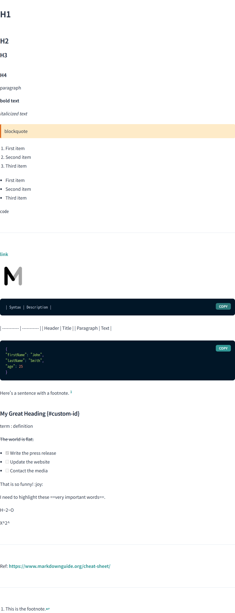

<h1 align="center">MDX-LIB</h1>

# What's this?
A library to make MDX more convenient.

### [English docs](https://github.com/mdx-lib/mdx-lib/tree/master/docs/en)

### [Japanese docs](https://github.com/mdx-lib/mdx-lib/tree/master/docs/ja)

