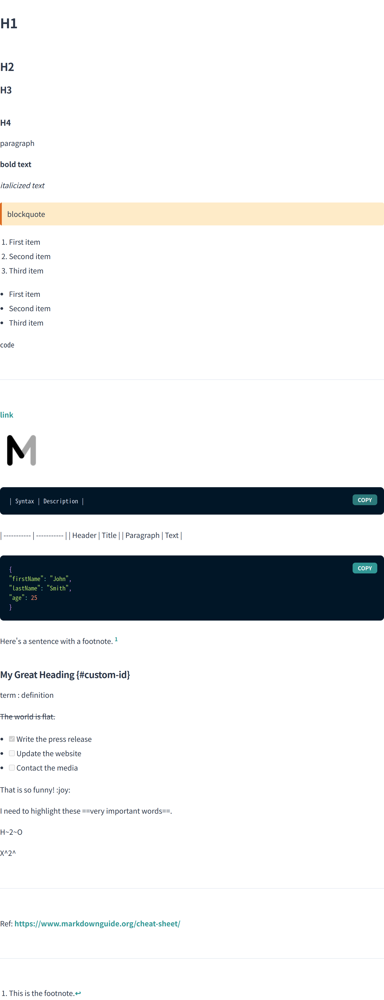

[](https://nx.dev)
[](https://www.typescriptlang.org)
[](LICENSE)

<p align="center"></p>
<h1 align="center">MDX-LIB</h1>

# What's this?
A library to make MDX more convenient.

# MDX with Chakra-ui

## Setup
### Add package
```shell
yarn add @mdx-lib/chakra
```

### Confirm & Add peerDependencies
Please confirm below dependencies are already installed.  
If it has not been added yet, please install the specified version of peerDependencies manually.

```shell
# confirm peerDependencies
npm info @mdx-lib/chakra@YOUR_VERSION peerDependencies
```

### Update theme
Please update the theme as follows for markdown styling.  
https://github.com/mdx-lib/mdx-lib/blob/main/apps/demo/theme.ts

### Add MDX provider
```tsx
import { ChakraMDXProvider } from '@mdx-lib/chakra'

function MyApp({ Component, pageProps }: AppProps) {
  return (
    <ChakraMDXProvider>
      <Component {...pageProps} />
    </ChakraMDXProvider>
  )
}
```

# For Contributor
## Setup
```shell
# Install all dependencies in monorepo
yarn bootstrap
```

# Sample Image
<p align="center"></p>

### NOTE
ChakraMDXProvider was created with reference to [chakra-ui-docs](https://github.com/chakra-ui/chakra-ui-docs)  [(MIT License)](https://github.com/chakra-ui/chakra-ui-docs/blob/83fa9b0083835bcad17930c31c9d126ed03017d0/README.md?plain=1#L279).  
Thanks to the people who made the code.
